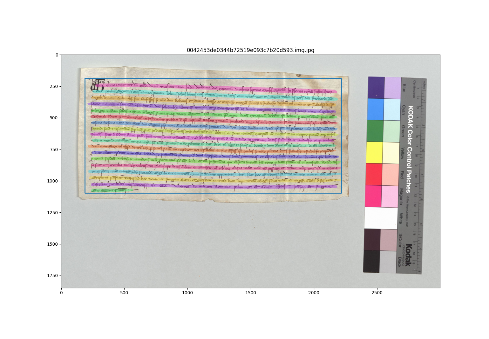
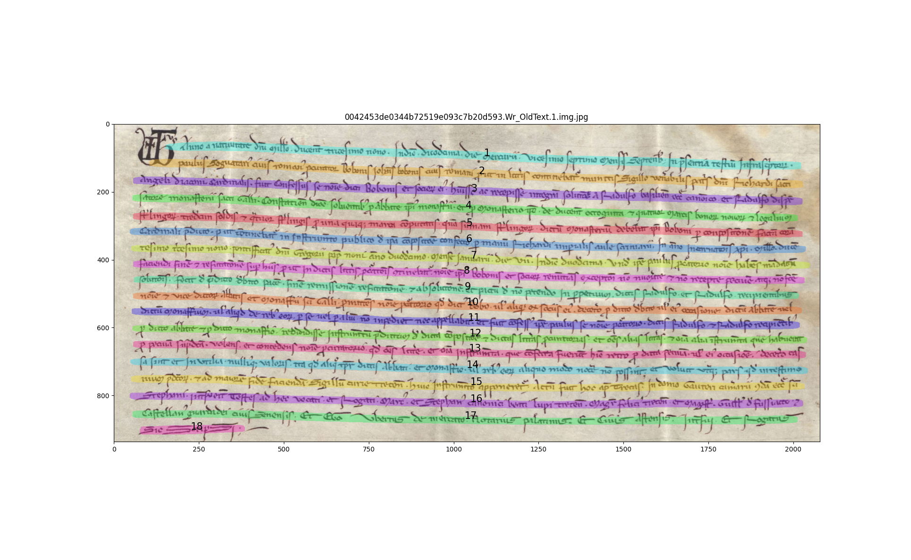

# Line segmentation (Mask-RCNN)


Line segmentation scripts, Kraken-free:

## Train and validate

Training script for Mask-RCNN, page-wide (with training set automatically built out of the provided image paths):

```sh
PYTHONPATH=. python3 ./bin/ddp_lineseg.py -img_paths dataset/*.jpg -max_epoch 400 -patience 50 -img_size 1024 -backbone resnet101 -batch_size 4
```

Validate (with validation set automatically built out of the provided image paths):

```sh
PYTHONPATH=. python3 ./bin/ddp_lineseg.py -mode validate -img_paths dataset/*.jpg
```

Patch-based training:

```sh
PYTHONPATH=. python3 ./bin/ddp_lineseg.py -img_paths dataset/*.jpg -max_epoch 400 -patience 50 -img_size 1024 -backbone resnet101 -batch_size 4 -train_style patch
```


## Detect and visualize


+ `ddp_line_detect.py` - for line detection on entire page, using an existing [layout analysis](https://github.com/anguelos/ddpa_layout.git) (`*.seals.pred.json`), if it exists:


  ```sh
  PYTHONPATH=. ./bin/ddp_line_detect.py -model_path best.mlmodel -mask_classes Wr:OldText -img_paths data/*.jpg -img_paths data/examples/0042453de0344b72519e093c7b20d593.img.jpg -output_format json
  ```

+ `ddp_lineseg_viewer.py` - reading an existing segmentation file:


  ```sh
  PYTHONPATH=. python3 ./bin/ddp_lineseg_viewer.py -img_paths data/examples/0042453de0344b72519e093c7b20d593.img.jpg -segfile_suffix lines.pred.json
  ```

  

+ `ddp_lineseg_viewer.py` - for debugging or monitoring purpose, on-the-fly prediction and viewing, using the entire image (no layout analysis):

  ```sh
  PYTHONPATH=. ./bin/ddp_lineseg_viewer.py -model_path best.mlmodel -rescale 1 -img_paths data/examples/0042453de0344b72519e093c7b20d593.Wr_OldText.1.img.jpg
  ```

  


## More examples

The segmentation pipeline is still in progress: [cases to ponder upon](data/curiosities/README.md).
