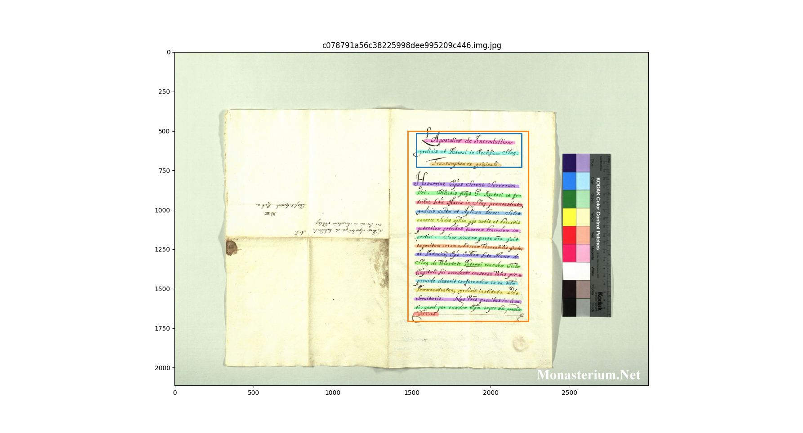
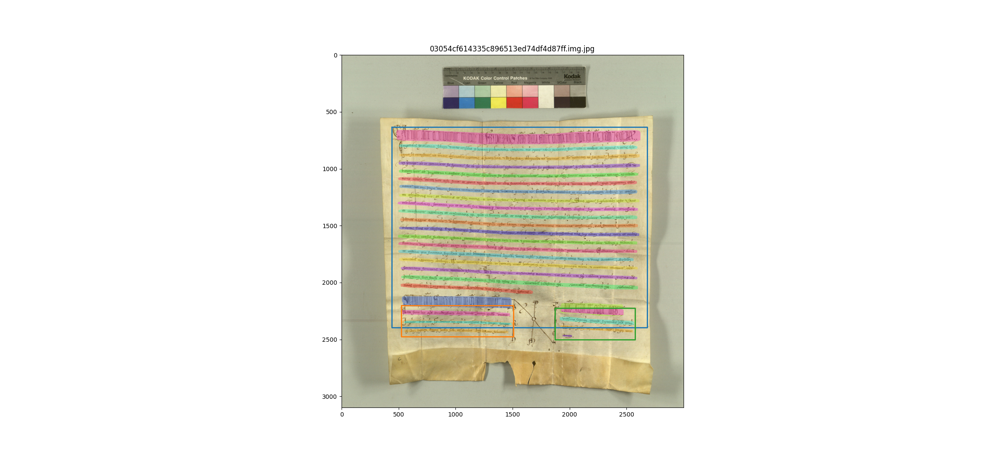
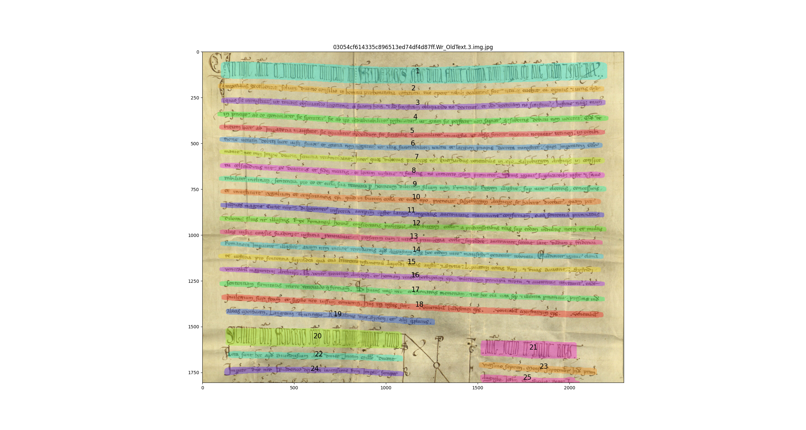
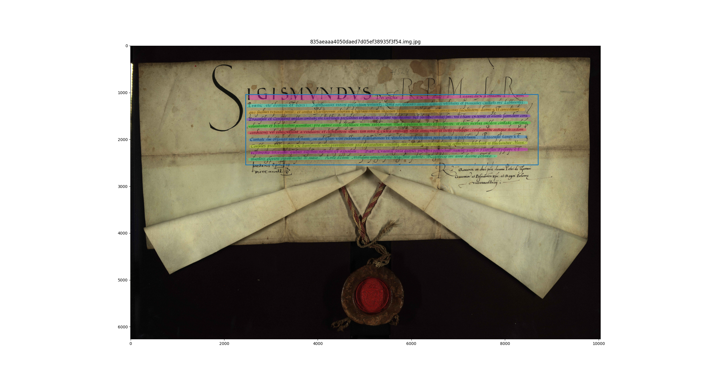

<style>
body { min-width: 90%; }
</style>

# Segmentation: study cases

## Nested regions

```bash
PYTHONPATH=. ./bin/ddp_line_detect.py -img_paths /home/nicolas/tmp/data/fsdb_work/fsdb_full_text_sample_1000/AT-StiASchl/b3ad697a1c5c0f1d90adbf6cdae1835d/8b1c792f745bbfa1c6f763cedd7929d1/c078791a56c38225998dee995209c446.img.jpg -model_path ./models/best_101_1024_bsz4.mlmodel -output_format stdout > data/curiosities/c078791a56c38225998dee995209c446.lines.pred.json

PYTHONPATH=. ./bin/ddp_lineseg_viewer.py -img_paths data/curiosities/c078791a56c38225998dee995209c446.img.jpg -segfile_suffix lines.pred.json
```




## Interrupted lines

Layout analysis detects 3 boxes:

```bash
PYTHONPATH=. ./bin/ddp_line_detect.py -img_paths /home/nicolas/tmp/data/fsdb_work/fsdb_full_text_sample_1000/AT-HHStA/eb8d75f7c2a1f46d3c919ef8267e88a3/83e160d9fad93b4892cd6556a2ac6db1/03054cf614335c896513ed74df4d87ff.img.jpg -model_path ./models/best_101_1024_bsz4.mlmodel -output_format stdout > data/curiosities/03054cf614335c896513ed74df4d87ff.lines.pred.json

PYTHONPATH=. ./bin/ddp_lineseg_viewer.py -img_paths data/curiosities/03054cf614335c896513ed74df4d87ff.img.jpg -segfile_suffix lines.pred.json
```



Line detection on largest crop only:

```bash
PYTHONPATH=. ./bin/ddp_lineseg_viewer.py -img_paths /home/nicolas/tmp/data/fsdb_work/fsdb_full_text_sample_1000/AT-HHStA/eb8d75f7c2a1f46d3c919ef8267e88a3/83e160d9fad93b4892cd6556a2ac6db1/03054cf614335c896513ed74df4d87ff.seals.crops/03054cf614335c896513ed74df4d87ff.Wr_OldText.3.img.jpg -model_path ./models/best_101_1024_bsz4.mlmodel -rescale 1
```




## First line not in old text

```bash
PYTHONPATH=. ./bin/ddp_line_detect.py -model_path models/best_101_1024_bsz4.mlmodel -img_paths /home/nicolas/tmp/data/fsdb_work/fsdb_full_text_sample_1000/PL-APL/4c1f48d641c5a90205cd03a912d947d8/cda4a2e73c6a4f51585f287b9976f77c/835aeaaa4050daed7d05ef38935f3f54.img.jpg -output_format stdout > data/curiosities/835aeaaa4050daed7d05ef38935f3f54.json

PYTHONPATH=. python3 ./bin/ddp_lineseg_viewer.py  -img_paths data/curiosities/835aeaaa4050daed7d05ef38935f3f54.img.jpg -segfile_suffix lines.pred.json
```



Generated with:

```bash
pandoc view.md --highlight-style pygments --metadata title='Segmentation Study Cases' -s -o view.html
```
